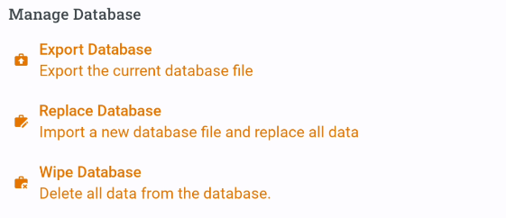

{}
WARNING: Using Developer Mode features can increase the chances of crashes and data loss. Use with caution.
{}

To enable Developer Mode, start a new operation, or open an existing one, type `KONAMI` in the callsign input field, and press the `[Send]` key (or `[RETURN]` or `[ENTER]`) in your keyboard.

You should see a short message confirming that the mode is now enabled.

You can use this same procedure to toggle it off.

You will now find new features and options in the app, usually highlighted in an orange color.

## Developer Mode Features

### Unstable Versions

In the Deverloper Settings you can now select between three different "update channels":

- **Stable**: The default channel, with the most stable and tested versions.

- **Unstable**: The latest versions, with new features and bug fixes, but not as well tested.

- **Bleeding Edge**: Work in progress, with the newest features and bug fixes, but also the most likely to have issues.

After changing channels, you should use the option to "Check for new versions" to download the latest version from the selected channel.

### Raw Data Export and Import

In Developer Mode you can now export and import raw data files used by PoLo, in the "QSON" data format used internally by the app.

You can export an operation in the Operation Settings tab. And you can import a QSON file as a new operation from the
main Developer Settings screen.

### Database Management

Enabling the Developer Mode provides for a way to backup the entire database or Wipe all the data from it. Typically, however, this provides a way to move your data from one device to another e.g. when you get a new device. Furture version of PoLo will provide a data syncing service, but this developer mode action can be carried out quite effectively. It can also provde a way to change your preferred device from time to time but keep all your data available on your chosen device.

Exporting the database to a cloud serivce of your choice is the easiest way to handle the database move. Then choosing Replace Database on the other device will allow selection of the new database. This is **NOT a merge function**. All data on the device being replaced will be lost and replaced by the select database from the previous export function.