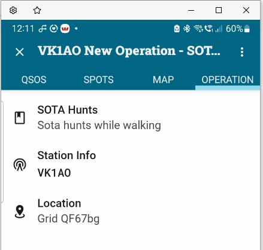
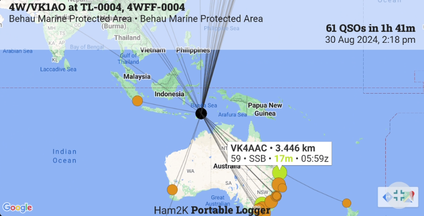

The QSO map is a very popular feature. There are some basic requirements to produce this map:

* Your location,
* The location of the other operator,
* Live/online data lookup (primary) or,
* Offline/Historical data (secondary).

### Your location
To provide the origin of the map, you must supply **your** location for each operation. If you select a park or summit etc, the location grid will be supplied by PoLo based on the park/summit/activity list. **Please note** that the grid will be based on the centroid of a park so a trail crossing several state borders may not accurately represent your exact location. In these cases, you should enter a gridsquare that represents your current location. You can use your device's GPS or enter the grid manually in the Operation Location setting.

In cases where you have chosen to log general QSOs, you must remember to enter your location manually. If no location (gridsquare) is set for your operation then when viewing the map, you will be warned of the missing parameter and prompted to return and set it.

**Why do I not see any lines on my QSO map?** Most likely because you do not have your own location set for the operation.

### The location of the other operator
The other operator may be at their home location, or in a park/summit etc. For operators at their home location, their gridsquare is sourced from either a live/online lookup (refer to [Data Lookups](../lookups/) in this doumentation), offline or historical data, or the Park2Park or Summit etc gridsquare.

### Live/online lookup
The primary source of lookup data at this time is QRZ and/or if active, HamDB lookups (free, but US, Canada and Germany only).
As stated elsewhere in this documentation, the details of live data from QRZ is subject to your subscription level. A paid subscription will return the other operator's gridsquare. Using a free subscription will **not** return this data. 

In the case of a missing gridsquare e.g. using a free subscription and a chaser at their home QTH, their location will be based on the ability of PoLo to interpret the callsign location. The location may be the centre of the operator's country only, or in some cases a state of the operator's country.

**Why do all the lines on my map go to one place, in the centre of the country?** The most likely reason is because you are limited to a free QRZ subscription and operator gridsquares are not available. Country centroids may be used in this case.

**Why are some QSO lines missing?** Again, the most likely reason is because you are limited to a free QRZ subscription and operator gridsquares are not available. Country centroids may be used in this case. So several contacts may be drawn to the same location and appear as if they are missing.

This can also happen even if you do have a paid QRZ account and you work more than one person in the same gridsquare. In this case, the dots may be drawn on top of one another and appear as if some lines or dots are missing.

### Offline/Historical Data
The secondary source of lookup data for your QSOs is historical data. You may, if you wish import an ADIF file of previous QSOs (your amateur radio log file). If this data is available, it will be used where other sources of data are not available.

Of course, if your historical data is all subject to a free QRZ subscription, operators' gridsquares will be missing. Gridsquares may be present as sourced from digital modes such as FT8. But in the main, your hisitorical data in this instance may only be able to provide name and address information as per [Data Lookups](../lookups/).

## The Map
If the above data is available, the map can be produced with your location centred. QSO lines are drawn for your contacts based on the level of data available and the map dots are coloured based on the band used for each contact. Clicking on a dot will reveal the QSO details.

