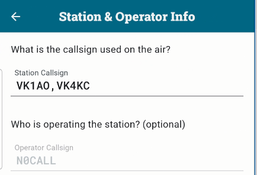
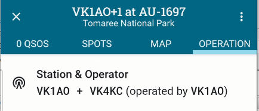
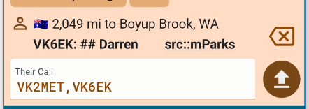
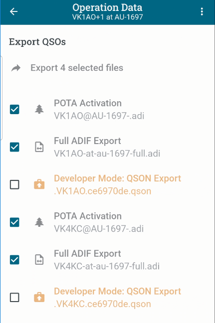

PoLo provides for a **single logging operation** where **more than one Operator** is activating, so one person can do the logging for both operators. On completion of the activation, separate logs will be generated for each Operator. There is no need to duplicate a single log and edit the contents for the second operator.

### Setup
After creating the operation and adding whatever activities are applicable, you can edit the **Station & Operator** settings to reflect the callsigns of the operators who are handing the microphone around.
The callsigns are entered as a comma separated list in the Station Callsign field.

Continue to log the calls as you would for a normal single operator operation/activation. The heading for the operation will indicate the number of operators.

### Self Spotting
When you spot with this setup, the default spot comment includes "**2 ops**" in the comment. Two spots will be created - one for each operator. This allows for non-PoLo environments to see both of you.

Polo Spots has the ability to consolidate spots from the same park on the same frequency. In cases like this, for other PoLo users, tapping on the spot for a multi-op activation will result in a log entry with both callsigns in the "Their Call" entry field. You can just confirm the callsigns and send them for 2 entries to be created in your log, one for each operator on the other end.

### Finalising/Exporting the logs
When you finish the operation, it's time to export the logs. This time, however, you will be offered the export of logs for each Operator in the comma separated list as separate logs.

### Future Template
Once this operation is present on your device, the setup will be offered as a Template. So for future operations with the same buddy, you can just choose the template to get the **Station & Operator** settings.
