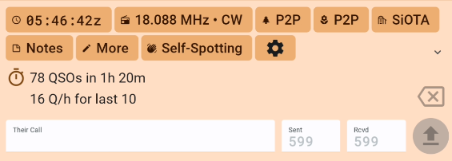
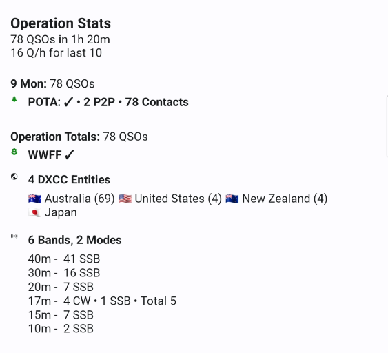

In the full version of PoLo, the top of the panel is demarcated by 4 tabs - QSOs, SPOTS, MAP and OPERATION

### QSOs

The PoLo QSOs List is where you will interact with the application once you've set up your operation. Once your frequency and mode have been entered (which may have been picked up from your previous operation) the left pointing (or less than) arrow expands the operations panel to show all available interactions. Tapping the Controls (settings) wheel will reveal any that are available, but not set with the operation. This might be useful when a caller from an unexpected award system such as UKBOTA or SiOTA call you. Selecting them from the More Controls section will make them available for use within the Active Controls. Once the selection is complete back out of the Controls section by tapping the Controls wheel.

Tapping an Active Control will provide the appropriate fields for information to be entered, eg P2P will enable park details to be entered in addition to the contact details. The Notes control is for per contact information to be added, and the More Control displays all information stored for the QSO.

The Callsign Information Panel can show various pieces of information dependant on your installation and circumstances.
* If you entered a qrz.com account in PoLo settings then the name and location held for your contact will be displayed.
* If you subscribe to qrz.com then their bearing and distance will also be displayed (assuming your contact has location details set at qrz.com)
* You should also see a country flag, and occasionally an emoji, that contact is in the Ham2K Hams of Note list. The meaning for these is covered in the emojis area of the manual.
* If you've worked a station previously then the number of contacts and time period will be displayed.

Once QSO details are entered, tapping the up arrow will save them into the operation log. Tapping that QSO or an other within the operation log will bring the details into the Callsign Information Panel where you can change them and save them by tapping the save icon, or delete the QSO with the trash can icon, which will need to be tapped twice before the QSO is lined through in the operation log. A deleted QSO can be recovered by tapping it in the operation log, then tapping the undo arrow, and saving.

### SPOTS
Tapping on the SPOTS tab will shift the view to the current spots which will be filtered according to your previous settings. Tapping a spot will pre-fill the QSO entry panel with the information from the spot you tapped. QSOs can be entered this way without chaging the frequency or band previously set in the QSO panel. When the QSo is saved, the previous settings return as active.

### MAP
Tapping on the MAP tab will shift the view to the QSO map for the current Operation. More information on Mapping can be found elsewhere in this manual.

### OPERATION
Finally, the OPERATION tab provides access to the settings such as your location, the activities attached to the operation and the features associated with exporting the operation logs ready for upload to 3rd party websites and your own home logging system if desired.

### Callsign Lookups
Tapping on the area above the callsign entry field will open the QRZ lookup for the callsign in focus. This provides further lookup data and the callsign Operator's QRZ default image. It also summarises contact history for that callsign.

### QRZ images
The QRZ lookup panel which displays the callsign's name and QTH details, also displays the default image from theoperator's QRZ page. This image is displayed by default, but can be turned off if your bandwidth is insufficient or you consider it unnecessary.

Tap the eye icon onb the bottom left corner of the image to make it disappear. This setting is sticky and will prevent future retrievals of all such images from QRZ. To turn image retrieval back on, tap the "Show Image" button to bring them back for future lookups.

### Operation Stats

Tapping on the QSO summary bar will display the operation summary which contains a summary of bands, modes, DXCC entities and activity such as park2Park contacts for the programs being activated.

